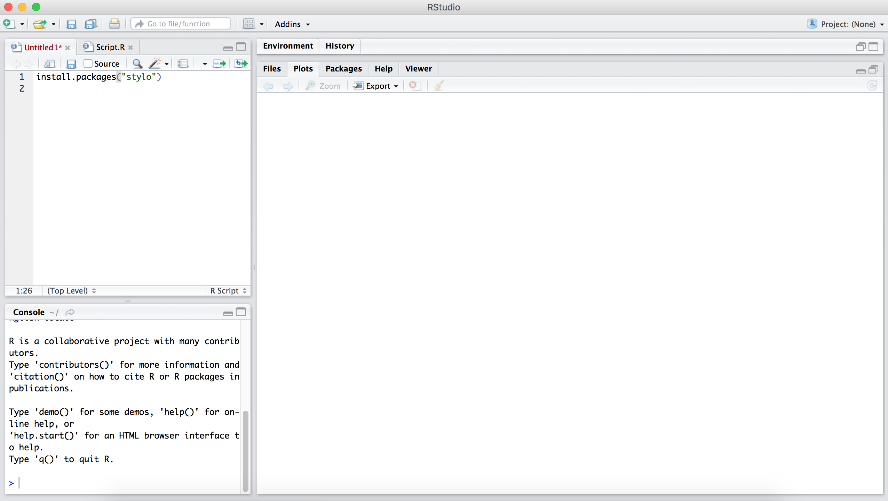
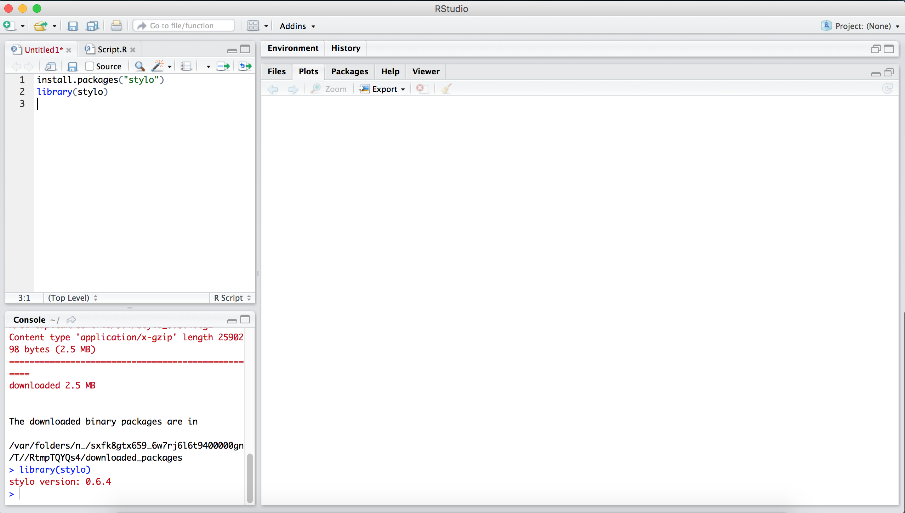
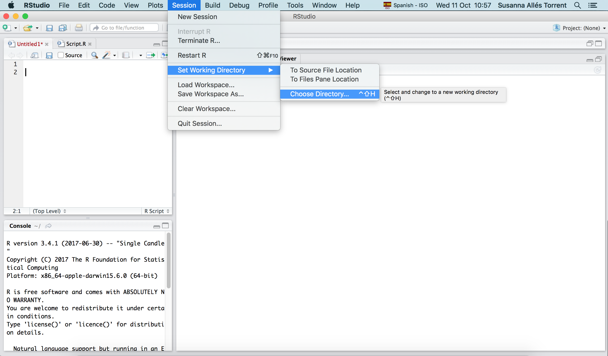
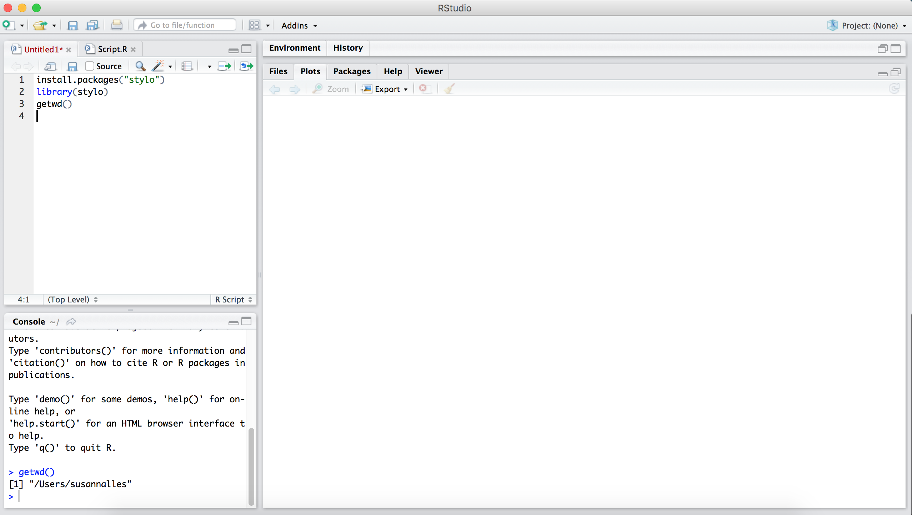
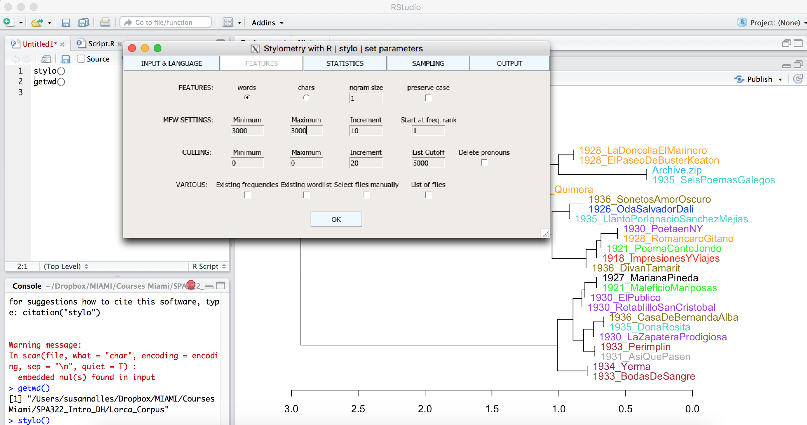

Miércoles 11 de octubre de 2017

## R Studio 

Estilometría: para descubrir el género de un texto, la fecha de un texto o la autoria (la atribución). 

¿Qué define el estilo de un autor? 
Palabras funcionales, vacías de contenido (de, a, por, así, ...)
 <https://www.mrc-cbu.cam.ac.uk/people/matt.davis/cmabridge/>

Pasos previos: 

* Crear un corpus en texto plano en UTF-8
* Asignar nombres de los ficheros de manera clara (sin espacios, ni acentos, etc.)
* Tokenización (reconocimiento de los caracteres o palabras individualmente). Quitar puntuación, caracteres numéricos. 
* A continuación podemos empezar a jugar con las palabras, calculando la distancia mínima entre ellas. 

# Parte 1 (Miércoles 11 Octubre 2017)

## Instalación: 
* Instalar <https://www.rstudio.com/products/rstudio/download/>
* Stylo <https://sites.google.com/site/computationalstylistics/stylo> es un paquete que puede instalarse en R. 

## Pasos a seguir:

* Abrid R Studio

 

* En el cuadro superior izquierdo escribid: `install.packages("stylo")`. Esto deberéis hacerlo sólo la primera vez que lo utilicéis.

* A continuación debes importar el paquete Stylo para poder trabajar con él: `library(stylo)`

* Ahora tenemos que establecer nuestro directorio de trabajo para que el programa sepa dónde están los archivos de texto: Session > "Set the working directory" > Choose directory > Elegid vuestra carpeta que debe contener a su vez la carpeta "corpus". Es muy importante que todos los archivos estén en una carpeta llamada "corpus" sino no funcionará. También puede escribirse en la consola `setwd("~/Dropbox/MIAMI/Courses Miami/SPA322_Intro_DH/Lorca_Corpus")` (aquí es donde lo tengo yo).

* Para asegurarnos que estamos en la carpeta correcta podemos escribir en la consola `getwd()` y veremos el path o dirección local donde estamos trabajando. En mi caso, veo: [1] "/Users/susannalles/Dropbox/MIAMI/Courses Miami/SPA322_Intro_DH/Lorca_Corpus"

* Ahora para empezar a visualizar los textos clicad en `stylo()`. Se os abrirá una ventana emergente y podéis clicar en "OK", entonces os aparecerá el primer gráfico.

* Ahora volved a correr `stylo()`, e id a 'Features > MFW Settings, miniminum and max to 3000`, y generad el gráfico graph2.png. "MFW" significa "Most Frequent Words". 

# PARTE II (Viernes 13 Octubre 2017)
1. Experimentad ahora cambiando el número de palabras más frecuentes que toma en consideración el programa: `stylo()` > `Features` > `MFW Settings`, cambiad los valores de Minimo y Máximo: 30, 50, 1000, 5000...  y comentadlo. 
2.  Ahora provad con `stylo()` > `statistics`> `Cluster Analysis`> `Consensus Tree` > `Consensus strength` con un valor de 0,5. 

## Casos de autoría: 
- Robert Galbraith, *The Cuckoo's Calling* by Jude Callegari = J. K. Rowling. El caso fue resuelto por dos forenses lingüísticos de la empresa Juola Associates. 
- Autenticidad de una obra de Julio César <http://dl.acm.org/citation.cfm?id=2989636>

## Libro imprescindible para introducirse a RStudio: 

- Jockers, Matthew. Text Analysis with R for Students of Literature. Cham: Springer, 2014. Disponible en línea: <http://link.springer.com/book/10.1007%2F978-3-319-03164-4>

## Otro libro algo más avanzado es:

- Taylor, Arnold, y Lauren Tilton. Humanities Data in R. Exploring Networks, Geospatial Data, Images, and Texts. Cham: Springer, 2015. Disponible en: <http://link.springer.com/book/10.1007%2F978-3-319-20702-5>
	 
Caso de estudio con herramientas de estilometría: <https://vimeo.com/70881172>

