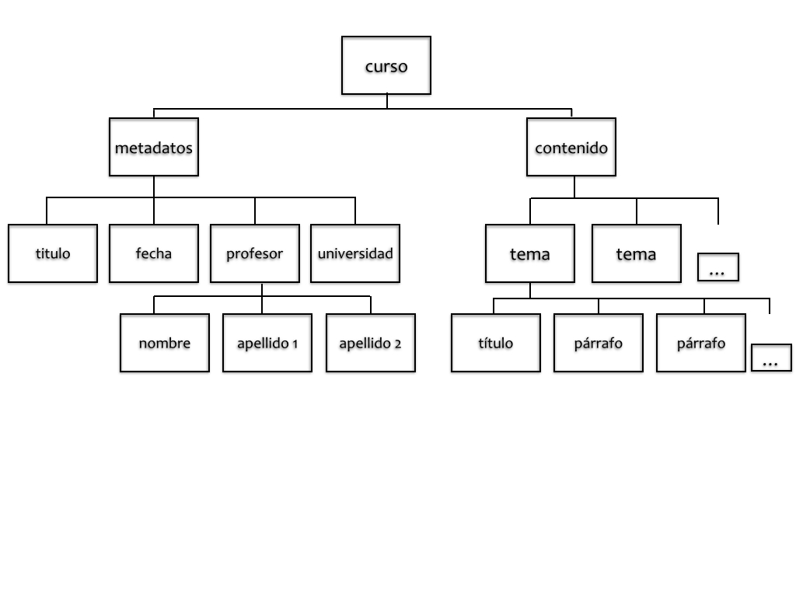

#### Tema 2: Principios fundamentales de XML (3)

**3. Estructura de un documento XML** 

Pasemos ahora a ver con más detalle cada una de las partes de un documento XML. Os aconsejo que para esta sección abráis el documento [ejemplo-2.xml](/o/10015222), un pequeño fichero XML comentado. Una vez descargado y abierto con oXygen u otro programa de edición XML, lo podéis anotar libremente con vuestros comentarios.

**3.1. Declaración XML**

Los documentos XML empiezan por una declaración XML:

`<?xml version="1.0" encoding="UTF-8"?>`

Este elemento no puede ir precedido por ningún comentario, ni espacio en blanco ni ningún otro elemento. Su función es simple pero crucial, y recubre tres objetivos básicos:

*  Declarar que es un documento XML; el paréntesis angular seguido del interrogante de cierre es interpretado como código por nuestra máquina y le está indicando que se trata de una declaración o una instrucción de procesamiento, no de un elemento corriente.

* Declarar qué versión del estándar XML se sigue; No es lo mismo utilizar la versión 1.0 que la 1.1\. Además, en el hipotético caso que en el futuro se publique una nueva versión (cosa que suele ocurrir con los lenguajes informáticos) es importante que dejemos para el futuro la versión específica utilizada para evitar problemas.

* Declarar qué caracteres de codificación utiliza el documento. Los documentos XML contienen texto cifrado en Unicode. Unicode es una combinación de caracteres que incluye prácticamente todas las lenguas del mundo y puede expresarse a través de diversos sistemas de codificación. Cada uno de estos sistemas establece un juego de caracteres (“character set”) específico que representa los caracteres (alfanuméricos y otros símbolos) a través de una secuencia de números (por ejemplo, imaginemos que el número 65 corresponde a la letra A). Así, cada combinación numérica corresponde a una letra o carácter, que difiere en cada uno de las diferentes codificaciones. Cada una de estas combinaciones de puntos se llama “puntos de código” (“code points”). La codificación de los caracteres determina cómo estos puntos de código son representados en bytes. De esta manera, el conjunto de caracteres de Unicode puede tener diferentes codificaciones como UTF-8, UCS-2, UCS-4 o UTF-16\. Por eso es importante señalar al inicio del documento qué codificación de caracteres hemos utilizado para que el parser sepa cómo descifrarlos y para que nuestra secuencia de texto se visualice de manera correcta. Aunque XML utiliza por defecto UTF-8, se podría también utilizar otro sistema según nuestras necesidades, como sería por ejemplo la combinación de caracteres ISO, por ejemplo, el ISO-8859-1 (Latin 1) que corresponde a las lenguas europeas occidentales, incluido el español.  
   
En algunos casos, en la declaración de documento también nos podemos encontrar el atributo “standalone”: 
 

    <?xml version="1.0" encoding="UTF-8" standalone=“no”?>  


Los valores del atributo “standalone” pueden ser afirmativo “yes” o negativo “no”; en el primer caso significa que no depende de ningún esquema externo y que por tanto el documento se regirá solo según las reglas del lenguaje XML; en cambio, si no es “standalone” significa que depende de un modelo abstracto concreto, es decir, concretamente de un esquema o DTD externos.

**3.2. Declaración de tipo de documento**

En algunos casos, un documento XML puede depender de un modelo abstracto que puede tener diferentes formas. Un caso frecuente es el modelo de la DTD (Document Type Definition), ampliamente utilizado en XML, aunque en desuso en el campo de TEI (donde se prefieren los esquemas RelaxNG). De esta manera, podemos encontrarnos en el prólogo del documento con una declaración del tipo de documento, “Documento Type” que tiene esta forma:  


<!DOCTYPE nombre_elemento_raiz SYSTEM "nombre.dtd">


Esta declaración está compuesta del identificador DOCTYPE, seguido del nombre del elemento raíz del documento que estamos marcando, a su vez seguido de SYSTEM con la indicación de la URL o ubicación del fichero DTD en cuestión (en este ejemplo, la DTD estaría en el mismo fichero que el documento XML). A veces, en lugar de SYSTEM, podemos encontrar PUBLIC, seguido de una URL; esto significa que la DTD está accesible de forma pública en la Web (normalmente se trata de algún estándar o de algún modelo público creado por una comunidad específica). Es el mismo procedimiento que podemos encontrar al inicio de un documento HTML 4 o XHTML:  


<!DOCTYPE html PUBLIC "-//W3C//DTD XHTML 1.1//EN" "http://www.w3.org/TR/xhtml11/DTD/xhtml11.dtd">


**3.3. Instrucciones de procesamiento**

Aunque ahora no nos detengamos en este aspecto, no está de más señalar que cuando nos encontramos con este tipo de sintaxis: al inicio `<?` y al final `?>`, en realidad se trata de Instrucciones de procesamiento (en inglés, “Processing Instructions”). En estos casos, XML está señalando que con ese fragmento de código el documento está ofreciendo un tipo determinado de información que debe ser procesada por otra aplicación. Por ejemplo, podríamos encontrar un script en PHP que iría destinada a ser procesada por una aplicación PHP; otro caso muy habitual es el de la asociación de una hoja de estilo CSS al mismo documento XML:


<?xml-stylesheet href= “formato.css” type= “text/css”?>


De momento es solo necesario que sepáis diferenciar entre una instrucción de procesamiento y los elementos XML propiamente dichos.

**3.4. Declaración del espacio de nombre**

En los documentos TEI aparece normalmente una declaración del “espacio de nombre” (en inglés, “namespace”). Por ejemplo, en un documento TEI aparece de la siguiente manera:


<TEI xmlns="http://www.tei-c.org/ns/1.0"> ... </TEI>


Los documentos XML pueden incluir elementos declarados en diferentes espacios de nombre. Por eso, la función de una tal declaración es la de evitar la ambigüedad de los nombres de los elementos y los atributos que pertenecen a una aplicación concreta de XML. Por ejemplo, imaginemos que en un mismo documento se utilizan dos sistemas de marcado que poseen elementos con el mismo nombre (por ejemplo `
`). Señalando el “espacio de nombre” dentro del cual cada uno de estos elementos debe ser interpretado se evitan errores y ambigüedades.

Desde el punto de vista formal, el espacio de nombre se representa a través de su URI, que funciona, en realidad, como un identificador externo y al que se asocia un prefijo de espacio de nombre. Es importante que se declaren todos los espacios de nombre utilizados en un documento, bajo forma de atributos `@xmlns` en el elemento raíz del documento.

Retomando el ejemplo anterior, vemos como se ha añadido el espacio de nombre de TEI en el elemento raíz, y por consiguiente sabemos que todos los elementos en su interior responden a ese espacio de nombre por defecto:


<TEI xmlns="http://www.tei-c.org/ns/1.0">
   <teiHeader>
   ....
   </teiHeader>
   <body>
     <text>
     ...
     </text>
   </body>


De no haberse declarado de esta manera y si quisiéramos añadir otro espacio de nombre, tendríamos que especificar el prefijo de cada uno de los espacios de nombre de los elemento con su prefijo o espacio de nombre correspondiente. Imaginemos el siguiente caso en que utilizamos etiquetas relativas a TEI y a Math, pues necesitamos marcar fórmulas matemáticas:


<tei:TEI xmlns:tei="http://www.tei-c.org/ns/1.0" xmlns:math="http://www.mathml.org">  
<tei:teiHeader>  
    ...  
</tei:teiHeader>  
<tei:text>  
<tei:body>  
<tei:p>Aquí el texto del párrafo...  
<math:expr>...Aquí la fórmula matemática...</math:expr>  
</tei:p>  
</tei:body>  
</tei:text>  
</tei:TEI>


Aunque el caso anterior sería correcto, lo más habitual es declarar un nombre de espacio por defecto y establecer los otros espacios de nombre con su prefijo correspondiente, de manera que el marcado no sea tan pesado:


<TEI xmlns="http://www.tei-c.org/ns/1.0" xmlns:math="http://www.mathml.org">  
<teiHeader>  
       ...  
</teiHeader>  
<text>  
<body>  

Aquí el texto del párrafo...  
<math:expr>...Aquí la fórmula matemática...</math:expr>  

  
</body>  
</text>  
</TEI>


Los dos objetivos principales del espacio de nombre son:  

* Diferenciar entre elementos y atributos de diferentes vocabularios con diferentes significados que puedan concurrir en el mismo documento con el mismo nombre.
* Agrupar conjuntamente todos los elementos y atributos relacionados de una aplicación concreta de XML de manera que el software pueda reconocerlos de manera más fácil.

**3.5. El elemento raíz**

Todo documento XML tiene un solo elemento raíz (en inglés, “root”), el único que no depende de ningún otro elemento y que contiene todos los otros. En [ejemplo-2.xml](), el esquema sería el siguiente:

Como vemos, la estructura arbórea consta de un solo elemento raíz (“curso”), del que descienden todos los otros elementos. Estos elementos pueden constituirse en lo que llamamos “nodos” (en inglés “nodes”) que pueden ser: a) un subárbol: por ejemplo, `<metadatos>` con sus cuatro elementos descendientes `<titulo>`, `<fecha>`, `<profesor>`, `<universidad>`; b) un simple elemento, por ejemplo, el nodo `<nombre>`; c) la misma secuencia de caracteres que encontramos como contenido al interior de los elementos. Es importante conocer esta nomenclatura, pues en algún momento del curso os la encontraréis.

**3.6. Elementos y contenido**

Los elementos son las unidades de información semántica compuestas de una marca de apertura `<elemento>` y de cierre `</elemento>`. El nombre del elemento constituye su identificador general y todo lo que queda entre estas dos marcas se llama “contenido”. Puede contener texto, otros elementos o estar vacío (`<elemento/>`).

En lo que concierne a los identificadores, es importante recordar que:

* el nombre del elemento puede solo contener letras y números (A-Z, a-z, 0-9), sin acentos ni espacios
* solo algunos signos pueden utilizarse: - (guión), _ (guión bajo), . (punto)
* el nombre no puede empezar por un número, ni por un signo, ni por “xml”
* XML es sensible a las mayúsculas y las minúsculas

**3.7. Atributos y valores**

Los elementos pueden poseer atributos que añadan una característica adicional al proprio elemento; su orden y número no es relevante. El nombre del atributo va siempre al interior de la etiqueta de apertura y va precedido de un espacio, seguido del símbolo `=`, y de comillas, dentro de las cuales aparece el `“valor”`. He aquí un ejemplo:


<fecha cuando="2014-01-06">06 enero 2014</fecha>  


Los nombres de los atributos deben formularse igual que los nombres de los elementos. Su orden al interior del elemento es libre, siempre y cuando no se repita.

**3.8. Comentarios y entidades**

Los documentos XML pueden contener comentarios para que los autores puedan dejar sus notas, normalmente relativas al proceso de codificación del mismo documento. Pueden aparecer en cualquier lugar del documento mientras sea contenido; no podrán nunca situarse al interior de una marca o etiqueta. Por regla general, no están destinados a ser procesados por la máquina, y de hecho, son ignorados por defecto. Los comentarios están delimitados por `<!--` y `-->`. Por ejemplo:


<!-- ¡esto es un comentario! -->


Por otro lado, las entidades de referencia (“entity references”) pueden ser de diferentes tipos de mayor o menor complejidad. En esta ocasión citaremos solo las entidades internas de caracteres, pues las encontraremos con una cierta frecuencia. Se trata de caracteres especiales que no deben ser interpretados como código. Por ello, determinados signos deben ser codificados de una manera especial. Sucede así en los siguientes casos:

* `&lt;` para indicar el símbolo “menor que” o el paréntesis angular de la marca de apertura: `<`
* `&gt;` para indicar el símbolo “mayor que” o el paréntesis angular de cierre de la marca: `>`
* `&amp;` para indicar: `&`
* `&quot;` para indicar las comillas dobles: `"`
* `&apos;` para indicar el apóstrofe o la comilla simple : `'`

[< < Anterior](2.2.html)         [Siguiente > >](2.4.html)