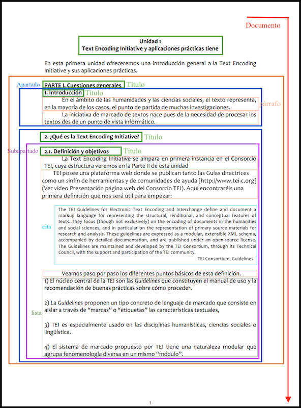

# Tema 6: Tipologías textuales (1)

En este tema tendremos oportunidad de trabajar con más detalles con algunos módulos TEI y con ciertas tipologías textuales. Aun así, es importante retener que para una información completa debemos siempre dirigirnos a las [_Guías directrices_](http://www.tei-c.org/release/doc/tei-p5-doc/en/html/) tal y como vimos en la tema anterior. Sólo así obtendremos una información detallada sobre las restricciones y el uso adecuado de los elementos, su estructura y su semántica.

## 1\. Prosa

Las _Guías directrices_ de TEI no tienen un módulo específico para la codificación de prosa, pues se trata de un término algo genérico y difícil de definir. La mayoría de los elementos utilizados para codificar textos en prosa pertenecen al módulo [core](http://www.tei-c.org/release/doc/tei-p5-doc/en/html/CO.html) y [textstructure](http://www.tei-c.org/release/doc/tei-p5-doc/en/html/DS.html), es decir, los elementos que aparecen integrados en la estructura TEI por defecto y que vimos en el Tema 4\.

Al afrontar la codificación de un texto, debemos, en primer lugar, llevar a cabo un análisis del documento, tal y como hicimos en el Tema 1, aislando las unidades estructurales de las que se compone. Partamos de un ejemplo concreto y veamos de qué manera podría ser codificado:

En esta página tenemos diferentes elementos que deberemos marcar, como por ejemplo:

*   Las divisiones que corresponden a la primera parte, a los apartados (1, 2...) y a los subapartados (1.1., 1.2., etc.)
*   Los títulos o encabezados
*   Los párrafos
*   Las citas bibliográficas
*   Las listas
*   Los números de página
*   Las referencias cruzadas

A partir de aquí, la idea consiste en encontrar un elemento TEI que responda a cada uno de estos conceptos y expresarlo tal y como proponen las _Guías directrices_.

**1.1\. [div](http://www.tei-c.org/release/doc/tei-p5-doc/es/html/ref-div.html): divisiones**

Como ya hemos visto, las diferentes partes del texto se delimitan con un elemento genérico llamado 
; de esta manera podemos crear una serie de divisiones jerárquicas tales como partes, capítulos, subcapítulos, secciones, subsecciones, etc. Debemos siempre recordar que las 
 pueden anidarse unas dentro de otras y pueden contener prácticamente todos los otros elementos TEI.

Es muy frecuente que el elemento 
 conlleve, además, diversos atributos, entre ellos:

*   @type para especificar y caracterizar el tipo de división.
*   @n para otorgarle una numeración precisa, aunque no es obligatorio pues el procesador puede localizar fácilmente su orden de aparición a partir del elemento padre.

**1.2\. [
](http://www.tei-c.org/release/doc/tei-p5-doc/es/html/ref-p.html): párrafos; [<ab>](http://www.tei-c.org/release/doc/tei-p5-doc/es/html/ref-ab.html) bloques anónimos**

El elemento 
 indica un párrafo y puede aparecer en cualquier tipo de texto. Los párrafos no pueden anidarse unos al interior de los otros, sino que deben situarse consecutivamente y, normalmente, aparecen en el interior de un elemento 
.

A veces una sección textual no corresponde exactamente a la noción de párrafo, y en ese caso podría utilizarse el elemento <ab> (_anonymous block_). Por ejemplo, en nuestro documento, podríamos marcar el texto introductorio con <ab> y relegar el elemento 
 para los párrafos de los apartados y subapartados.

**1.3\. [<head>](http://www.tei-c.org/release/doc/tei-p5-doc/es/html/ref-head.html): títulos y encabezados **

Los encabezados y títulos de cualquier tipo se marcan con el elemento <head> que puede conllevar, como en los casos anteriores, diversos atributos, como @type, para indicar el tipo de título.

En nuestro documento, se podrían codificar como <head> todo lo que aparece en negrita y que hemos incluido en los cuadros verdes. Ahora bien, si quisiéramos clasificarlos en vista, por ejemplo, de una presentación podríamos establecer tipologías diferentes:

> > <head type="Principal">Unidad 1</head>  
> > <head type="parte">PARTE I</head>  
> > <head type="apartado">1. Introducción</head>

Aun así, no sería ni mucho menos obligatorio porqué los diversos <head> son localizables por el procesador a partir del elemento del que forman parte, de manera que cada <head> podría  tener una presentación diferente en función del elemento padre al que pertenecen.

**1.4\. [<cit>](http://www.tei-c.org/release/doc/tei-p5-doc/es/html/ref-cit.html): citas **

Las citas pueden ser de muchos tipos diferentes, pero las más habituales son aquellas en que se reproducen de manera literal las palabras de otra fuente, acompañadas de la indicación bibliográfica. En estos casos, se utiliza el elemento <cit> que debe estar formado, a su vez, por [<quote>](http://www.tei-c.org/release/doc/tei-p5-doc/es/html/ref-quote.html) que encierra propiamente las palabras de la cita, y por [<bibl>](http://www.tei-c.org/release/doc/tei-p5-doc/es/html/ref-bibl.html) que debe contener la referencia bibliográfica:

> > <cit>  
> >     <quote>The TEI Guidelines for Electronic Text Encoding and Interchange define and document a markup language for representing the structural, renditional, and  conceptual features of </quote>  
> >     <bibl>TEI Consortium</bibl>  
> > </cit>

En un trabajo en prosa, y especialmente en monografías y trabajos de investigación, la bibliografía suele codificarse separadamente, tal y como lo haríamos tradicionalmente. Puede ir incluida en el <teiHeader>, pero también en el <front>, <back> o incluso dentro de <text> creando una división especial, del tipo 
.

Cada ítem bibliográfico debe tener su identificador (@xml:id) para que pueda ser fácilmente localizable y recuperable. De esta manera, cuando en el cuerpo del texto nos aparece una cita de ese ítem bibliográfico nos referimos a él con el atributo @corresp al interior del elemento <bibl>: 

> > <bibl corresp="#Guidelines">TEI Consortium</bibl>

**1.5\. [<list>](http://www.tei-c.org/release/doc/tei-p5-doc/es/html/ref-list.html): listas**

En esta tipología textual, aparecen en muchos casos listas de elementos; en TEI, como vimos el otro día, deben marcarse con el elemento <list>, y cada uno de los ítems se codifica con el elemento [<item>](http://www.tei-c.org/release/doc/tei-p5-doc/es/html/ref-item.html).

Si a cada ítem lo antecede un título podríamos utilizar [<label>](http://www.tei-c.org/release/doc/tei-p5-doc/es/html/ref-label.html); pero, quizás, lo más interesante sean los diferentes tipos de listas que podemos crear a partir del atributo @type, para indicar el tipo de contenido (TEI propone como valores: gloss, index, instructions, litany, syllogism), y los atributos @rend o @style para determinar el tipo de presentación, donde los valores propuestos son: numbered, inline, bulleted, simple.

**1.6\. Referencias cruzadas**

Es también habitual que en un texto en prosa nos encontremos con referencias cruzadas que apunten al interior del documento o a una fuente externa. Los elementos para indicar este tipo de referencias y enlaces son [<ref>](http://www.tei-c.org/release/doc/tei-p5-doc/es/html/ref-ref.html) y [<ptr/>](http://www.tei-c.org/release/doc/tei-p5-doc/es/html/ref-ptr.html). La diferencia básica entre los dos es que el primero puede tener contenido y corresponde en realidad al típico enlace tal cual estamos acostumbrados a ver, mientras que <ptr/> (_pointer_) es un elemento vacío e indica sólo que en ese punto del texto aparece algo que crea un enlace, como por ejemplo un tipo concreto de imagen.

El resultado final, pues, de nuestro texto podría ser el que encontraréis en el fichero publicado en el aula bajo el nombre de <a href="">ejemplo_prosa.xml</a>.

### [< < Anterior](5.1.html)         [Siguiente > >](6.2.html)