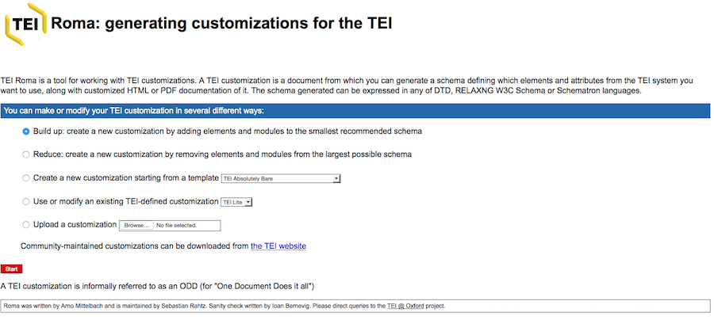
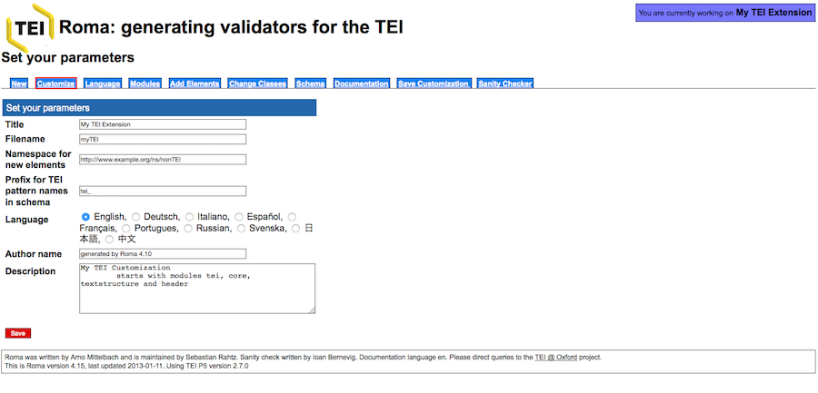
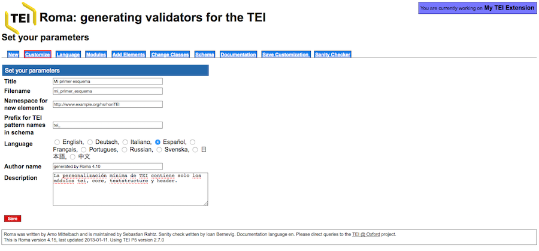
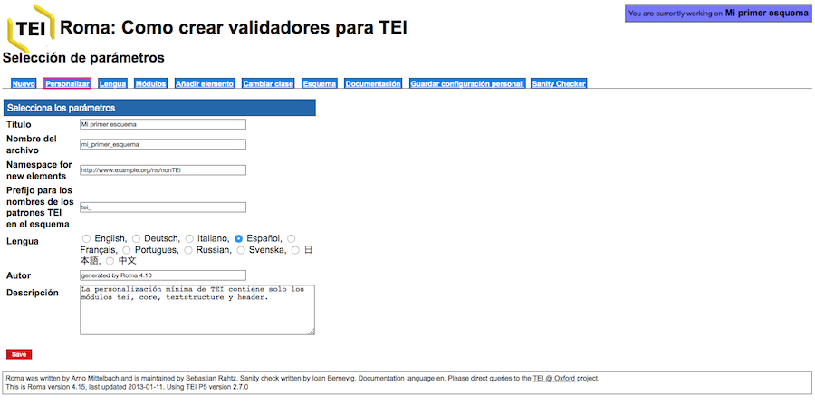
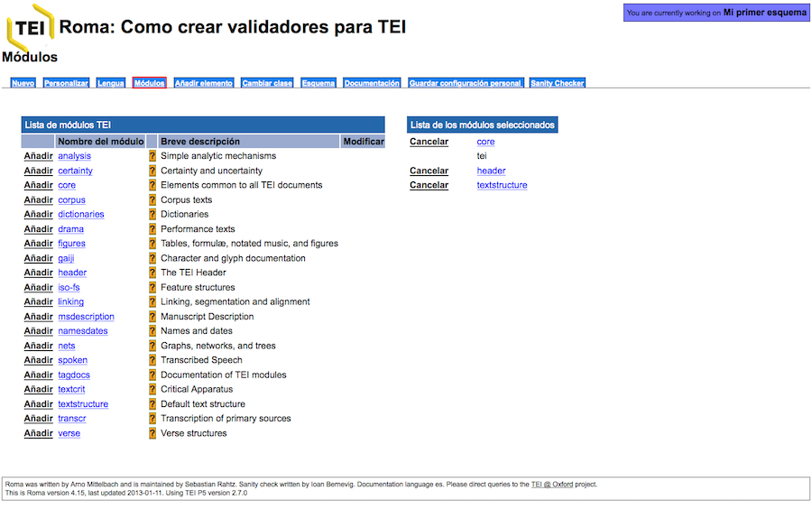
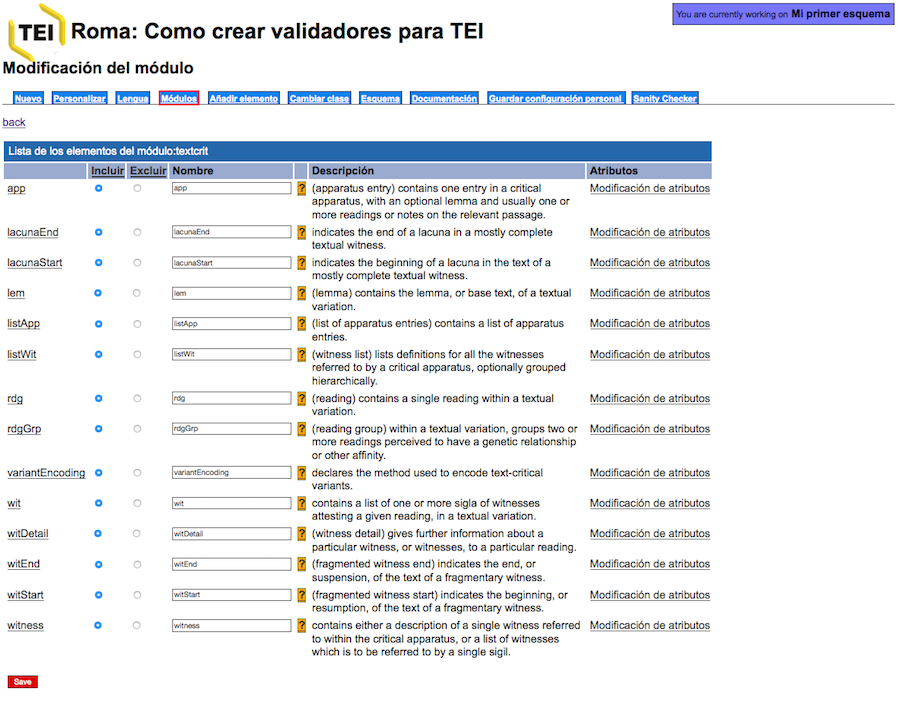
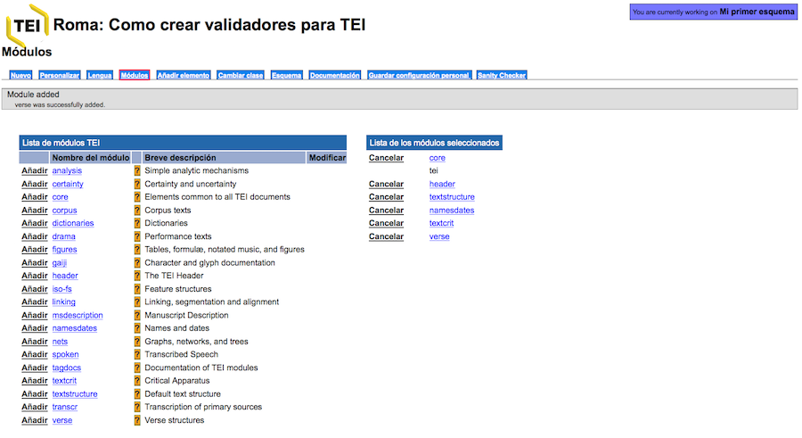
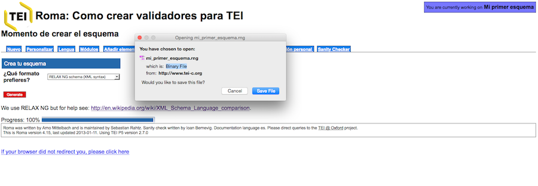
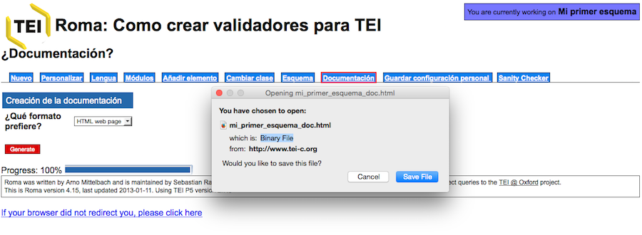

# Tema 7: Personalización TEI (2)

## 5\. Aplicación Roma y cómo construir un esquema

La sintaxis de los esquemas puede parecer complicada a simple vista, pero el esquema Relax NG realmente es el más sencillo y podríamos crearlo y modificarlo a mano. Aún así, el consorcio TEI pone a nuestra disposición una plataforma, llamada Roma, para la creación y la manipulación de un esquema a nuestra medida.

En este apartado vamos a ver cómo funciona Roma y cómo construir un esquema a nuestra medida.

Hay dos opciones a la hora de construir un esquema:

*   Elegir un esquema ya creado por la comunidad TEI, como puede ser la ya mencionada versión mínima, llamada TEI Lite, o la que incluye todos los elementos TEI All, ambas utilizadas ya en nuestros ejercicios. En este [enlace](http://www.tei-c.org/Guidelines/Customization/) encontraréis los diferentes modelos. El programa oXygen tambié contiene estos esquemas.
*   Crear un nuevo modelo a partir de la aplicación [Roma](http://www.tei-c.org/Roma/). [Aquí](http://www.tei-c.org/Guidelines/Customization/use_roma.xml) encontraréis las indicaciones ofrecidas por el Consorcio TEI.

Esta es la interfaz de inicio de la plataforma ROMA:

Las opciones disponibles son las siguientes:

*   _Build up_: Construir un modelo personalizado a partir de una versión mínima con sólo los cuatro módulos obligatorios. El proceso consiste en añadir módulos y personalizar los elementos y atributos.
*   _Reduce_: Construir un modelo personalizado a partir una versión máxima con todos los módulos TEI. El proceso consiste en eliminar módulos y elementos y atributos.
*   _Create a new customization starting from a template_: Crear un modelo a partir de una de las plantillas propuestas por TEI.
*   _Use or modify an existing TEI-defined customization_: Crear un modelo a partir de la modificación del modelo TEI Lite.
*   _Upload a customization_: Sección para subir a la plataforma un modelo ya existente en forma de documento ODD.

Elegiremos la primera opción _Build up_, es decir, crearemos un esquema a partir de una versión mínima que sólo contiene los módulos obligatorios. La siguiente pantalla corresponde a los metadatos:

  

En este caso las opciones que se nos ofrecen son las siguientes:

*   _Title_
*   _Filename_
*   _Namespace for new elements_
*   _Prefix for TEI pattern names in schema_
*   _Language_
*   _Author name_
*   _Description_

Cambiemos las informaciones por defecto por las nuestras y seleccionemos como lengua de la interfície el "Español":

Y guardamos el esquema, clicando el botón rojo “Save”.

Fijaros que lo único que ha cambiado es el nombre de nuestro esquema que en lugar de llamarse “My extension TEI”, ahora tiene el nombre que le hemos dado “Mi primer esquema":

Veamos ahora las otras opciones:

*   _Nuevo_
*   _Lengua_
*   _Módulos_
*   _Añadir elemento_
*   _Cambiar clase_
*   _Esquema_
*   _Documentación_
*   _Guardar configuración personal_

**A) Nuevo**: retrocede a la pantalla de inicio

**B) Personalizar**: corresponde a la pantalla donde hemos creado el título y los otros metadatos del esquema.

**C) Lengua**: En este apartado tenemos la posibilidad de elegir entre diferentes lenguas, esto nos proporcionará una documentación de los elementos en la lengua escogida (siempre que exista una traducción). En nuestro caso, podemos escoger “Español”, aunque debemos tener en cuenta que la más actualizada y completa es la versión en inglés (Ya habéis visto en las _Guías directrices_ como no todos los elementos y secciones están traducidas al español).

**D) Módulos**: esta es una de las pantallas más importantes, pues es aquí donde elegiremos qué módulos vamos a incluir en nuestro esquema:

Como veis, la columna de la izquierda contiene todos y cada uno de los módulos TEI, mientras que el de la derecha recoge sólo los obligatorios: core, tei, header, textstructure. A partir de aquí, debemos saber a qué módulos pertenecen los fenómenos textuales que queremos codificar. Por lo general, si trabajamos con textos teatrales, tendremos que incluir el módulo drama, si trabajamos con poesía el módulo verse, si trabajamos con diccionarios el módulo dictionaries, etc.

Podemos acceder a cada uno de los módulos y ver todos los elementos que contiene. Por ejemplo, si accedemos al módulo textcrit, observamos la lista completa:

  

Una vez al interno de los módulos podemos “Excluir” aquellos elementos que no necesitemos para nuestra codificación. En lo que concierne al “Nombre” conviene dejarlo tal y como está para no provocar confusiones con el sistema estándar TEI de nombres de elementos, es decir, si cambiamos, por ejemplo, <app> por <aparato>, la etiqueta en nuestro documento XML-TEI aparecería como <aparato> y no como <app>. Además, tenemos la posibilidad de modificar los atributos, manteniendo los que nos interesan y suprimiendo los que no necesitamos.

Al interior de cada uno de los elementos, tenemos la posibilidad de detallar ulteriormente la “Descripción” de ese elemento. Dicha descripción es la que aparecerá en el apartado correspondiente de la documentación. Por ejemplo, retomemos el elemento <app> e imaginemos que queremos encuadrarlo en nuestro proyecto, de manera que sea útil a las personas que eleborarán la codificación, o incluso, para nostros mismos.

Supongamos que queremos hacer la edición crítica de una obra lírica del siglo de Oro. Para ello, en primer lugar, deberemos seleccionar los módulos que nos interesan, en este caso, textcrit y verse. Pero también podemos prever que codificaremos los nombres de los personajes y los diferentes lugares que aparecen en el texto, en ese caso incluimos: namesdates.

Una vez añadidos los diferentes módulos que nos interesen veremos en la columna de la derecha los módulos seleccionados:

  

**E) Añadir elemento**: A continuación, podríamos pasar a la pestaña “Añadir elemento”, en el caso que quisiéramos crear un nuevo elemento que no nos proporciona TEI; para ello, tendríamos que adjudicarle una clase de modelo y una clase de atributos. Esta práctica debe evitarse en línea de máxima a no ser que sea estrictamente necesario.

**F) Cambiar clase**: Lo mismo sucede con esta pestaña; podría darse el caso que un determinado elemento no tuviera los atributos que necesitamos, en tal caso, podríamos modificarlos y añadir de nuevos en esta sección.

**G) Esquema**: esta sección permite escoger el tipo de esquema que queremos: DTD, W3C, RelaxNG, etc.

Este es uno de los momentos cruciales, pues aquí es donde podremos obtener un esquema en el formato que deseemos. Las opciones que se nos ofrecen son las siguientes:

*   Relax NG schema (compact syntax) .rnc
*   Relax NG schema (XML syntax) .rng
*   ISO Schematron
*   Schematron
*   W3C Schema .xsd
*   DTD .dtd

Escogeremos la opción Relax NG schema (XML syntax) y pulsaremos “Generate”; acto seguido se nos descargará el esquema que hemos elaborado:

**H) Documentación**: Permite escoger que tipo de formato se prefiere para la documentación del esquema. Tenemos la posibilidad de bajarnos en un único documento la descripción de cada uno de los elementos y atributos elegidos en nuestro esquema según las Guías directrices. Los formatos pueden ser:

*   HTML web page
*   PDF
*   TEI Lite
*   TEI ODD

La opción más útil es la HTML, pues nos generará un simple documento HTML donde tendremos todos los elementos y atributos incluidos en nuestro esquema para poder consultarlos fácilmente en forma de página web:

**I) Guardar configuración personal**: Esta pantalla también es de vital importancia porqué es la que genera el fichero ODD que veremos en el siguiente y último tema. En pocas palabras, se trata de un fichero XML que recoge todas las características del esquema personalizado y permite rehacerlo cuantas veces lo deseemos, conservando las modificaciones hechas.

**J) Sanity Checker** Permite comprobar las decisiones hechas para tu personalización. Normalmente, si no has incluido nuevos elementos o eliminado partes esenciales, suele dar positivo.

### [< < Anterior](7.1.html)         [Siguiente > >](8.1.html)