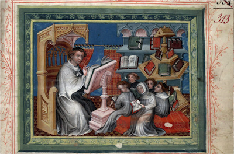

### War, Love, and Storytelling in Medieval and Early Modern Europe

In this seminar we will study three main topics in the Literature of the Middle Ages and Early Modern Western Europe, approximately from 800 to 1500 CE. We will focus on War, Love, and Storytelling, and we will analyze their evolution diachronically and geographically. War and Epics in the chanson de geste will offer us a field of exploration: Which are the values shared by the Chançon de Roland and the Cantar de Mio Cid, why the great French hero Roland turns into the madly in love and raging Orlando in Ariosto's masterpiece, or what Don Quixote and the medieval heroes have in common. Our attention will then turn to Medieval romance, especially on courtly love and poetry, analyzing differences between Spaniards and French troubadours, and the poets of the Italian Dolce Stil Novo, continuing to Petrarch and his reception during the Renaissance. Next, we will pay particular attention to the form of storytelling, analyzing the French roman and lai, and the short narrative of the Decameron. The seminar will be taught in English and will be conducted through discussions of primary and secondary materials. The readings of primary sources will be given in the original language (French, Spanish, Italian, or Catalan) and in translation. Students seeking to fulfill a language requirement in French or Spanish should complete their written coursework in that language.

 

*EPICS*

I. [The concept of Medieval Europe and its Literature](Intro.html) (Jan. 24, 2019)

II. [France, la chançon de geste, and the *Song of Roland*](French_Epics.html) (Jan. 31)

III. [Iberian Peninsula and its heores: *Cantar de Mio Cid*](Iberian_Epics.html) (Feb. 7)

IV. [From Boiardo to Ariosto](Italian_Epics.html) (Feb. 14)

*STORYTELLING*

V. [Marie de France's *Lais*](French_Storytelling.html) (12th century) (Feb. 21)

VI. [Giovanni Boccaccio's *Decameron*](Italian_Storytelling.html) (Feb. 28)

VII. [Don Juan Manuel, *El conde de Lucanor*](Iberian_Storytelling.html) (Mar. 7)

*LOVE*

VIII. French Troubadours and the Courtly Love <!--(FrenchTroubadours.html)--> (Mar. 21)

IX. Italy, Dolce Stil Novo, Dante<!--(Italian_poetry.html)--> (Mar. 28)

X. The Standarization of Poetry and Petrarch <!--(Italian_poetry2.html)--> (Apr. 4)

XI. Chivalry Romances, Amadís de Gaula, Tirant Lo Blanch <!--(chivalry.html)--> (Apr. 11)

XII. Quixote as anti-heroe <!--(Quixote.html)--> (Apr. 14) 