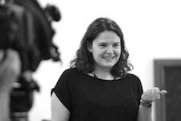

 
 
My areas of specialisation are Digital Humanities, Medieval and Early Modern Iberian Studies. My research explores several aspects of scholarly digital editions, electronic text analysis, intertextuality, and digital lexicography. I also work with the intersection of the Iberian Peninsula and Italy in the Middle Ages and the Renaissance, reconstructing cultural and literary networks between the two.

In 2012 I earned my PhD from the University of Barcelona (UB), and I also completed an MA in digital humanities at the École Nationale des Chartes (Paris). Since then have sought to combine textual scholarship with digital scholarly editions, philology with markup languages, and literary corpora with electronic text analysis.

 I’m the author of *Las Vitae Hannibalis et Scipionis de Donato Acciaiuoli, traducidas por Alfonso de Palencia* ([Brepols](http://www.brepols.net/Pages/ShowProduct.aspx?prod_id=IS-9782503556062-1), 2014) and a number of articles in journals such as *Insula*, *Anuario de Estudios Medievales*, *Cuadernos de Filología Clásica*, etc. 

I have been postdoctoral fellow at the Spanish National Research Council (CSIC) in Barcelona, Visiting Scholar at the Center for Digital Scholarship at Brown University, and Lecturer in Digital Humanities in the Department of Latin American and Iberian Cultures at Columbia University.
