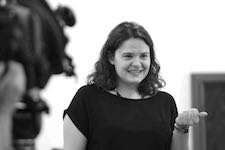

 
 I am an [assistant professor](http://www.as.miami.edu/mll/people/faculty/dr-susanna-alles-torrent/) in the Department of Modern Languages and Literatures at the [University of Miami](http://www.as.miami.edu/mll/), where I teach Digital Humanities and Romance Medieval Literature.

My areas of specialisation are Digital Humanities, Medieval Latin and Romance Studies (Spanish, Catalan, and Italian). My research explores several aspects of scholarly digital editions, electronic text analysis, intertextuality and text reuse, and digital lexicography. I also work with the intersection of the Iberian Peninsula and Italy in the Middle Ages and the Renaissance, reconstructing cultural and literary networks between the two.

In 2012 I earned my PhD from the University of Barcelona (UB), and I also completed an MA in digital humanities at the École Nationale des Chartes (Paris). Since then have sought to combine textual scholarship with digital scholarly editions, philology with markup languages, and literary corpora with electronic text analysis.

I have been postdoctoral fellow at the Spanish National Research Council (CSIC) in Barcelona, and Lecturer in Digital Humanities in the Department of Latin American and Iberian Cultures at Columbia University.

### Research Interests:
**Digital Humanities**: Scholarly Digital Editions; eXtensible Markup Language and related technologies (XSLT, XPath, XQuery); Text Encoding Initiative; Web technologies; Electronic Textual Analysis; Data mining and Analysis of Linguistics Corpora; Stylistic Analysis and Authorship Studies

**Medieval & Renaissance Studies**: Mediterranean Cultures and Languages; Translation Studies; Medieval and Early Modern Translations in the Iberian Peninsula (1200-1600); Textual Scholarship and Philology; Biography as genre; Medieval Latin and Romance Lexicography; Classical Tradition and Reception in Romance Literature PROJECTS
